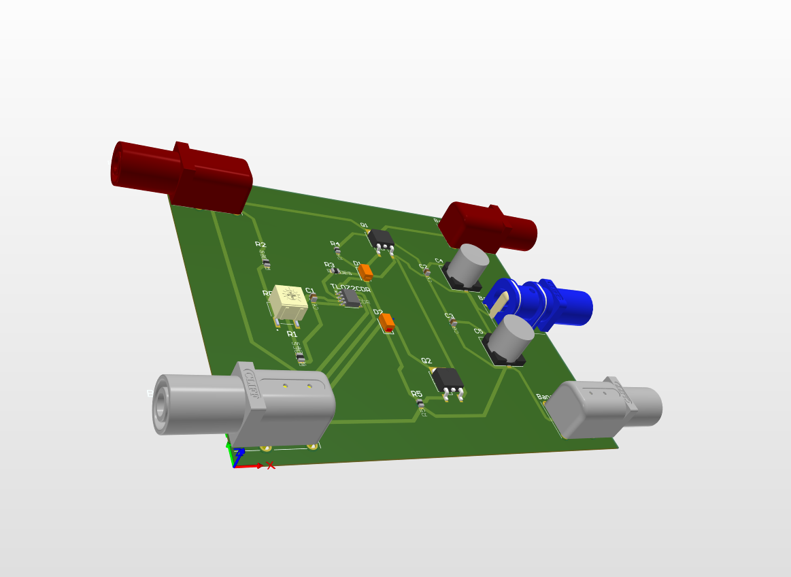

# Symmetric ±15V Power Supply

Symmetric power supply designed to generate ±15V from a single 
+30V input, built as part of my preparation for a Master's 
in Analog IC Design.

## Overview

Many analog circuits such as OPAMPs require symmetric supply 
voltages. This design generates a stable ±15V virtual ground 
reference from a single +30V source using a TL072CDR as a 
high-impedance buffer and a class AB output stage for current 
capability.

## Block Diagram

+30V Input → Adjustable Voltage Divider → TL072CDR Buffer → Class AB Output Stage → ±15V Output

## Specifications

| Parameter | Value |
|---|---|
| Input voltage | +30V |
| Output voltage | ±15V |
| Ripple +15V | 60mV Vpp |
| Ripple -15V | 60mV Vpp |
| Dominant ripple frequency | 50Hz (mains) |
| Adjustment | Trimmer potentiometer |

## Circuit Description

**Voltage divider** — R1, RPOT1 and R2 form an adjustable 
divider that generates the +15V virtual ground reference. 
RPOT1 allows fine adjustment of output symmetry.

**TL072CDR buffer** — The first OPAMP of the TL072CDR buffers 
the virtual ground reference with high input impedance, 
isolating the divider from the output stage.

**Class AB output stage** — Q1 (NPN) and Q2 (PNP) provide 
current drive capability. D1 and D2 bias the transistors 
to minimize crossover distortion. R4 and R5 limit base current.

## PCB Design

Designed in Altium Designer 26. 2-layer PCB with solid 
GND plane on Bottom Layer for noise reduction.

Gerber files included — ready for fabrication.

## Measurements

All measurements performed with Rigol DS1102Z-E oscilloscope.

### +15V Output — 60mV Vpp Ripple

### -15V Output — 60mV Vpp Ripple

### FFT Analysis — Single 50Hz Component

FFT analysis confirms that the only significant ripple 
component is at 50Hz from the mains supply. No parasitic 
oscillations or harmonics observed, confirming loop stability.

### Ripple Analysis

| Rail | Ripple | Dominant frequency | Assessment |
|---|---|---|---|
| +15V | 60mV Vpp | 50Hz | Acceptable for analog signal circuits |
| -15V | 60mV Vpp | 50Hz | Acceptable for analog signal circuits |

The 50Hz ripple originates from the lab power supply 
(PeakTech 6205). The TL072CDR rejects it according to 
its PSRR, but cannot eliminate it completely.

## Known Limitations & Next Steps

- Increase output capacitance to 1000µF to reduce 
  50Hz ripple below 50mV Vpp
- Add 100pF compensation capacitor between TL072 output 
  and inverting input to improve PSRR
- PCB fabrication and post-layout characterization

## Tools Used

| Tool | Purpose |
|---|---|
| LTspice | Schematic simulation and stability analysis |
| Altium Designer 26 | Schematic capture and PCB layout |
| Rigol DS1102Z-E | Output characterization and FFT analysis |
| PeakTech 6205 | Lab power supply |

## Author

Aarón Báguena Rodríguez — Electronics Engineering Student  
Preparing for Master's in Analog IC Design  
[LinkedIn](www.linkedin.com/in/aaron-baguena-rodriguez-9a10b1391)
